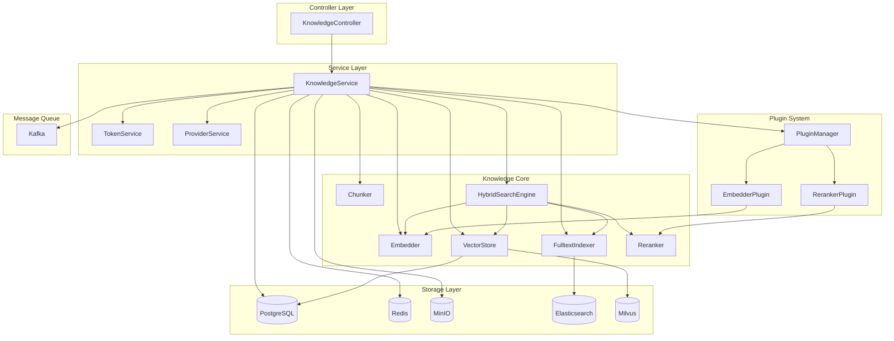
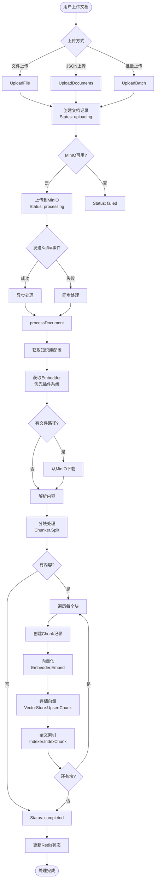
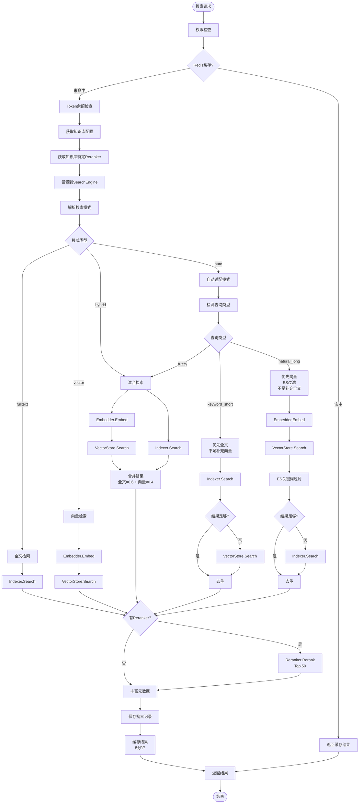
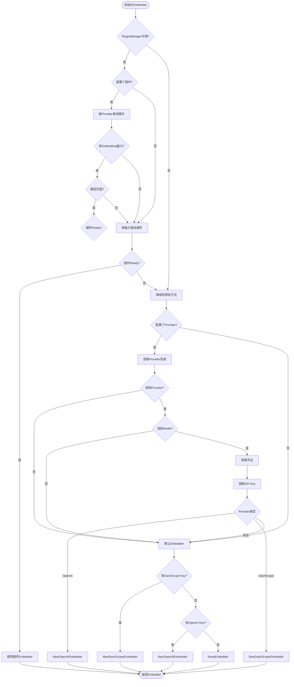
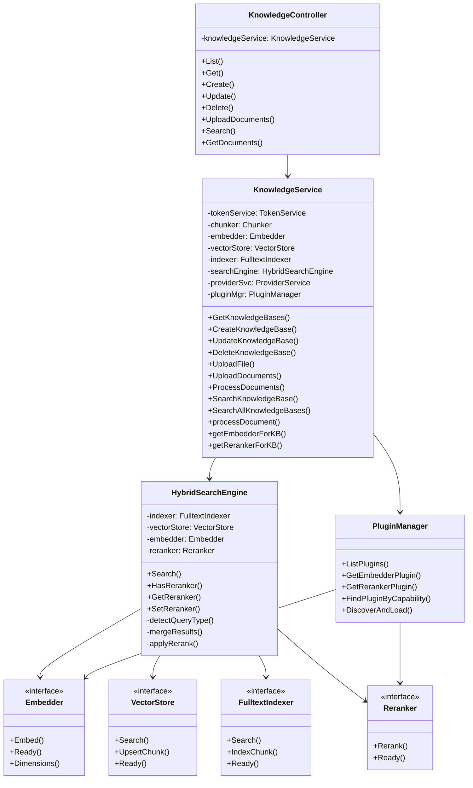
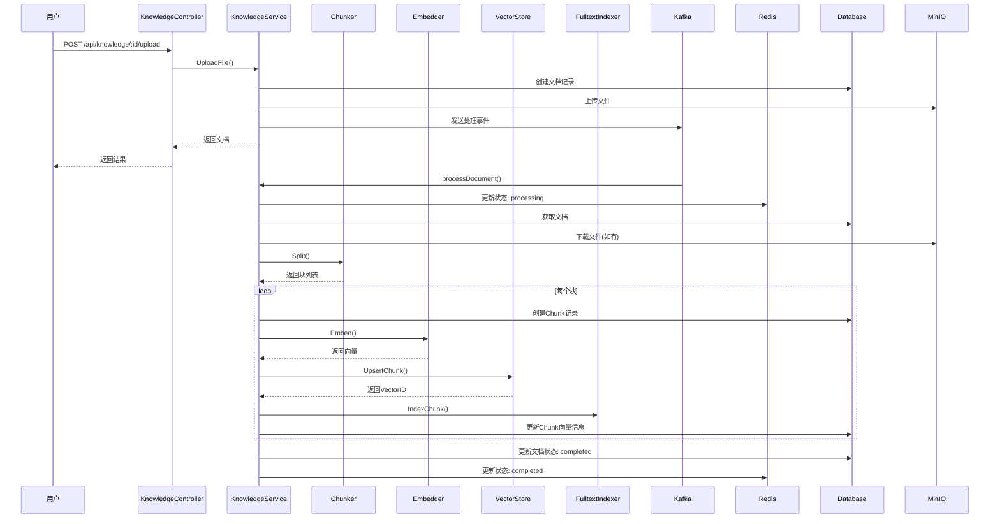
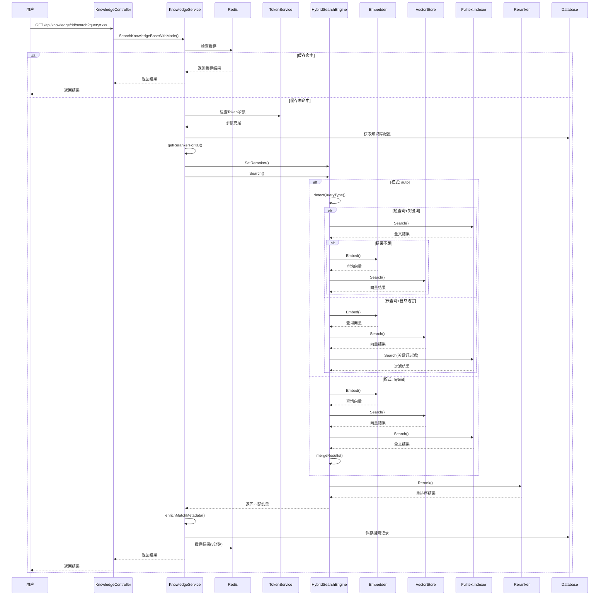
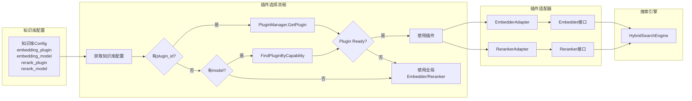

# 知识库系统架构图 (Mermaid)

## 1. 系统架构组件图

```mermaid
graph TB
    subgraph "Controller Layer"
        KC[KnowledgeController]
    end
    
    subgraph "Service Layer"
        KS[KnowledgeService]
        TS[TokenService]
        PS[ProviderService]
    end
    
    subgraph "Knowledge Core"
        CH[Chunker]
        EMB[Embedder]
        VS[VectorStore]
        IDX[FulltextIndexer]
        HSE[HybridSearchEngine]
        RER[Reranker]
    end
    
    subgraph "Plugin System"
        PM[PluginManager]
        EP[EmbedderPlugin]
        RP[RerankerPlugin]
    end
    
    subgraph "Storage Layer"
        DB[(PostgreSQL)]
        REDIS[(Redis)]
        MINIO[(MinIO)]
        ES[(Elasticsearch)]
        MILVUS[(Milvus)]
    end
    
    subgraph "Message Queue"
        KAFKA[Kafka]
    end
    
    KC --> KS
    KS --> TS
    KS --> PS
    KS --> CH
    KS --> EMB
    KS --> VS
    KS --> IDX
    KS --> HSE
    KS --> PM
    HSE --> EMB
    HSE --> VS
    HSE --> IDX
    HSE --> RER
    PM --> EP
    PM --> RP
    EP --> EMB
    RP --> RER
    KS --> DB
    KS --> REDIS
    KS --> MINIO
    IDX --> ES
    VS --> MILVUS
    VS --> DB
    KS --> KAFKA
```

## 2. 文档处理流程图

```mermaid
flowchart TD
    Start([用户上传文档]) --> Upload{上传方式}
    Upload -->|文件上传| FileUpload[UploadFile]
    Upload -->|JSON上传| JSONUpload[UploadDocuments]
    Upload -->|批量上传| BatchUpload[UploadBatch]
    
    FileUpload --> CreateDoc[创建文档记录<br/>Status: uploading]
    JSONUpload --> CreateDoc
    BatchUpload --> CreateDoc
    
    CreateDoc --> MinIO{MinIO可用?}
    MinIO -->|是| UploadMinIO[上传到MinIO<br/>Status: processing]
    MinIO -->|否| SetFailed[Status: failed]
    
    UploadMinIO --> KafkaEvent{发送Kafka事件}
    KafkaEvent -->|成功| AsyncProcess[异步处理]
    KafkaEvent -->|失败| SyncProcess[同步处理]
    
    AsyncProcess --> ProcessDoc[processDocument]
    SyncProcess --> ProcessDoc
    
    ProcessDoc --> CheckKB[获取知识库配置]
    CheckKB --> GetEmbedder[获取Embedder<br/>优先插件系统]
    GetEmbedder --> DownloadFile{有文件路径?}
    
    DownloadFile -->|是| DownloadMinIO[从MinIO下载]
    DownloadFile -->|否| ParseContent[解析内容]
    DownloadMinIO --> ParseContent
    
    ParseContent --> Chunk[分块处理<br/>Chunker.Split]
    Chunk --> ChunkEmpty{有内容?}
    ChunkEmpty -->|否| Complete[Status: completed]
    ChunkEmpty -->|是| ForEachChunk[遍历每个块]
    
    ForEachChunk --> CreateChunk[创建Chunk记录]
    CreateChunk --> Embed[向量化<br/>Embedder.Embed]
    Embed --> StoreVector[存储向量<br/>VectorStore.UpsertChunk]
    StoreVector --> Index[全文索引<br/>Indexer.IndexChunk]
    Index --> NextChunk{还有块?}
    NextChunk -->|是| ForEachChunk
    NextChunk -->|否| Complete
    
    Complete --> UpdateRedis[更新Redis状态]
    UpdateRedis --> End([处理完成])
```

## 3. 搜索流程图

```mermaid
flowchart TD
    Start([搜索请求]) --> Auth[权限检查]
    Auth --> Cache{Redis缓存?}
    Cache -->|命中| ReturnCache[返回缓存结果]
    Cache -->|未命中| TokenCheck[Token余额检查]
    
    TokenCheck --> GetKB[获取知识库配置]
    GetKB --> GetReranker[获取知识库特定Reranker]
    GetReranker --> SetReranker[设置到SearchEngine]
    
    SetReranker --> ParseMode[解析搜索模式]
    ParseMode --> Mode{模式类型}
    
    Mode -->|auto| AutoMode[自动适配模式]
    Mode -->|fulltext| FulltextMode[全文检索]
    Mode -->|vector| VectorMode[向量检索]
    Mode -->|hybrid| HybridMode[混合检索]
    
    AutoMode --> DetectQuery[检测查询类型]
    DetectQuery --> QueryType{查询类型}
    QueryType -->|keyword_short| KeywordShort[优先全文<br/>不足补充向量]
    QueryType -->|natural_long| NaturalLong[优先向量<br/>ES过滤<br/>不足补充全文]
    QueryType -->|fuzzy| HybridMode
    
    FulltextMode --> FulltextSearch[Indexer.Search]
    VectorMode --> EmbedQuery[Embedder.Embed]
    EmbedQuery --> VectorSearch[VectorStore.Search]
    
    HybridMode --> EmbedQuery2[Embedder.Embed]
    EmbedQuery2 --> VectorSearch2[VectorStore.Search]
    HybridMode --> FulltextSearch2[Indexer.Search]
    VectorSearch2 --> Merge[合并结果<br/>全文×0.6 + 向量×0.4]
    FulltextSearch2 --> Merge
    
    KeywordShort --> FulltextSearch3[Indexer.Search]
    FulltextSearch3 --> CheckResults{结果足够?}
    CheckResults -->|否| VectorSearch3[VectorStore.Search]
    CheckResults -->|是| Dedupe1[去重]
    VectorSearch3 --> Dedupe1
    
    NaturalLong --> EmbedQuery3[Embedder.Embed]
    EmbedQuery3 --> VectorSearch4[VectorStore.Search]
    VectorSearch4 --> ESFilter[ES关键词过滤]
    ESFilter --> CheckResults2{结果足够?}
    CheckResults2 -->|否| FulltextSearch4[Indexer.Search]
    CheckResults2 -->|是| Dedupe2[去重]
    FulltextSearch4 --> Dedupe2
    
    FulltextSearch --> Rerank{有Reranker?}
    VectorSearch --> Rerank
    Merge --> Rerank
    Dedupe1 --> Rerank
    Dedupe2 --> Rerank
    
    Rerank -->|是| ApplyRerank[Reranker.Rerank<br/>Top 50]
    Rerank -->|否| Enrich[丰富元数据]
    ApplyRerank --> Enrich
    
    Enrich --> SaveSearch[保存搜索记录]
    SaveSearch --> CacheResult[缓存结果<br/>5分钟]
    CacheResult --> Return[返回结果]
    ReturnCache --> Return
    Return --> End([结束])
```

## 4. Embedder 选择流程图

```mermaid
flowchart TD
    Start([初始化Embedder]) --> PluginMgr{PluginManager可用?}
    PluginMgr -->|是| CheckPluginConfig{配置了插件?}
    PluginMgr -->|否| Fallback[降级到原有方式]
    
    CheckPluginConfig -->|是| FindByProvider[按Provider查找插件]
    CheckPluginConfig -->|否| FindByCapability[按能力查找插件]
    
    FindByProvider --> CheckCapability{有Embedding能力?}
    CheckCapability -->|是| CheckModel{模型匹配?}
    CheckCapability -->|否| FindByCapability
    CheckModel -->|是| CheckReady{插件Ready?}
    CheckModel -->|否| FindByCapability
    
    FindByCapability --> CheckReady2{插件Ready?}
    CheckReady2 -->|是| UsePlugin[使用插件Embedder]
    CheckReady2 -->|否| Fallback
    
    Fallback --> CheckConfig{配置了Provider?}
    CheckConfig -->|是| GetCatalog[获取Provider目录]
    CheckConfig -->|否| DefaultEmbedder[默认Embedder]
    
    GetCatalog --> FindProvider{找到Provider?}
    FindProvider -->|否| DefaultEmbedder
    FindProvider -->|是| FindModel{找到Model?}
    FindModel -->|否| DefaultEmbedder
    FindModel -->|是| GetCredential[获取凭证]
    
    GetCredential --> ExtractKey[提取API Key]
    ExtractKey --> ProviderType{Provider类型}
    ProviderType -->|OpenAI| OpenAIEmbedder[NewOpenAIEmbedder]
    ProviderType -->|DashScope| DashScopeEmbedder[NewDashScopeEmbedder]
    ProviderType -->|其他| DefaultEmbedder
    
    DefaultEmbedder --> CheckDashScopeKey{有DashScope Key?}
    CheckDashScopeKey -->|是| DashScopeEmbedder2[NewDashScopeEmbedder]
    CheckDashScopeKey -->|否| CheckOpenAIKey{有OpenAI Key?}
    CheckOpenAIKey -->|是| OpenAIEmbedder2[NewOpenAIEmbedder]
    CheckOpenAIKey -->|否| NoopEmbedder[NoopEmbedder]
    
    UsePlugin --> End([返回Embedder])
    OpenAIEmbedder --> End
    DashScopeEmbedder --> End
    OpenAIEmbedder2 --> End
    DashScopeEmbedder2 --> End
    NoopEmbedder --> End
```

## 5. 知识库服务类关系图

```mermaid
classDiagram
    class KnowledgeService {
        -tokenService: TokenService
        -chunker: Chunker
        -embedder: Embedder
        -vectorStore: VectorStore
        -indexer: FulltextIndexer
        -searchEngine: HybridSearchEngine
        -providerSvc: ProviderService
        -pluginMgr: PluginManager
        +GetKnowledgeBases()
        +CreateKnowledgeBase()
        +UpdateKnowledgeBase()
        +DeleteKnowledgeBase()
        +UploadFile()
        +UploadDocuments()
        +ProcessDocuments()
        +SearchKnowledgeBase()
        +SearchAllKnowledgeBases()
        +processDocument()
        +getEmbedderForKB()
        +getRerankerForKB()
    }
    
    class HybridSearchEngine {
        -indexer: FulltextIndexer
        -vectorStore: VectorStore
        -embedder: Embedder
        -reranker: Reranker
        +Search()
        +HasReranker()
        +GetReranker()
        +SetReranker()
        -detectQueryType()
        -mergeResults()
        -applyRerank()
    }
    
    class KnowledgeController {
        -knowledgeService: KnowledgeService
        +List()
        +Get()
        +Create()
        +Update()
        +Delete()
        +UploadDocuments()
        +Search()
        +GetDocuments()
    }
    
    class PluginManager {
        +ListPlugins()
        +GetEmbedderPlugin()
        +GetRerankerPlugin()
        +FindPluginByCapability()
        +DiscoverAndLoad()
    }
    
    class Embedder {
        <<interface>>
        +Embed()
        +Ready()
        +Dimensions()
    }
    
    class Reranker {
        <<interface>>
        +Rerank()
        +Ready()
    }
    
    class VectorStore {
        <<interface>>
        +Search()
        +UpsertChunk()
        +Ready()
    }
    
    class FulltextIndexer {
        <<interface>>
        +Search()
        +IndexChunk()
        +Ready()
    }
    
    KnowledgeController --> KnowledgeService
    KnowledgeService --> HybridSearchEngine
    KnowledgeService --> PluginManager
    HybridSearchEngine --> Embedder
    HybridSearchEngine --> VectorStore
    HybridSearchEngine --> FulltextIndexer
    HybridSearchEngine --> Reranker
    PluginManager --> Embedder
    PluginManager --> Reranker
```

## 6. 数据流图

```mermaid
sequenceDiagram
    participant User as 用户
    participant Controller as KnowledgeController
    participant Service as KnowledgeService
    participant Chunker as Chunker
    participant Embedder as Embedder
    participant VectorStore as VectorStore
    participant Indexer as FulltextIndexer
    participant Kafka as Kafka
    participant Redis as Redis
    participant DB as Database
    
    User->>Controller: POST /api/knowledge/:id/upload
    Controller->>Service: UploadFile()
    Service->>DB: 创建文档记录
    Service->>MinIO: 上传文件
    Service->>Kafka: 发送处理事件
    Service-->>Controller: 返回文档
    Controller-->>User: 返回结果
    
    Kafka->>Service: processDocument()
    Service->>Redis: 更新状态: processing
    Service->>DB: 获取文档
    Service->>MinIO: 下载文件(如有)
    Service->>Chunker: Split()
    Chunker-->>Service: 返回块列表
    
    loop 每个块
        Service->>DB: 创建Chunk记录
        Service->>Embedder: Embed()
        Embedder-->>Service: 返回向量
        Service->>VectorStore: UpsertChunk()
        VectorStore-->>Service: 返回VectorID
        Service->>Indexer: IndexChunk()
        Service->>DB: 更新Chunk向量信息
    end
    
    Service->>DB: 更新文档状态: completed
    Service->>Redis: 更新状态: completed
```

## 7. 搜索序列图

```mermaid
sequenceDiagram
    participant User as 用户
    participant Controller as KnowledgeController
    participant Service as KnowledgeService
    participant Redis as Redis
    participant TokenSvc as TokenService
    participant SearchEngine as HybridSearchEngine
    participant Embedder as Embedder
    participant VectorStore as VectorStore
    participant Indexer as FulltextIndexer
    participant Reranker as Reranker
    participant DB as Database
    
    User->>Controller: GET /api/knowledge/:id/search?query=xxx
    Controller->>Service: SearchKnowledgeBaseWithMode()
    Service->>Redis: 检查缓存
    alt 缓存命中
        Redis-->>Service: 返回缓存结果
        Service-->>Controller: 返回结果
        Controller-->>User: 返回结果
    else 缓存未命中
        Service->>TokenSvc: 检查Token余额
        TokenSvc-->>Service: 余额充足
        Service->>DB: 获取知识库配置
        Service->>Service: getRerankerForKB()
        Service->>SearchEngine: SetReranker()
        Service->>SearchEngine: Search()
        
        alt 模式: auto
            SearchEngine->>SearchEngine: detectQueryType()
            alt 短查询+关键词
                SearchEngine->>Indexer: Search()
                Indexer-->>SearchEngine: 全文结果
                alt 结果不足
                    SearchEngine->>Embedder: Embed()
                    Embedder-->>SearchEngine: 查询向量
                    SearchEngine->>VectorStore: Search()
                    VectorStore-->>SearchEngine: 向量结果
                end
            else 长查询+自然语言
                SearchEngine->>Embedder: Embed()
                Embedder-->>SearchEngine: 查询向量
                SearchEngine->>VectorStore: Search()
                VectorStore-->>SearchEngine: 向量结果
                SearchEngine->>Indexer: Search(关键词过滤)
                Indexer-->>SearchEngine: 过滤结果
            end
        else 模式: hybrid
            SearchEngine->>Embedder: Embed()
            Embedder-->>SearchEngine: 查询向量
            SearchEngine->>VectorStore: Search()
            VectorStore-->>SearchEngine: 向量结果
            SearchEngine->>Indexer: Search()
            Indexer-->>SearchEngine: 全文结果
            SearchEngine->>SearchEngine: mergeResults()
        end
        
        SearchEngine->>Reranker: Rerank()
        Reranker-->>SearchEngine: 重排序结果
        SearchEngine-->>Service: 返回匹配结果
        Service->>Service: enrichMatchMetadata()
        Service->>DB: 保存搜索记录
        Service->>Redis: 缓存结果(5分钟)
        Service-->>Controller: 返回结果
        Controller-->>User: 返回结果
    end
```

## 8. 插件系统集成图

```mermaid
graph LR
    subgraph "知识库配置"
        KBConfig[知识库Config<br/>embedding_plugin<br/>embedding_model<br/>rerank_plugin<br/>rerank_model]
    end
    
    subgraph "插件选择流程"
        KBConfig --> GetKBConfig[获取知识库配置]
        GetKBConfig --> CheckPluginID{有plugin_id?}
        CheckPluginID -->|是| GetPluginByID[PluginManager.GetPlugin]
        CheckPluginID -->|否| CheckModel{有model?}
        CheckModel -->|是| FindByCapability[FindPluginByCapability]
        CheckModel -->|否| UseGlobal[使用全局Embedder/Reranker]
        
        GetPluginByID --> CheckReady{Plugin Ready?}
        FindByCapability --> CheckReady
        CheckReady -->|是| UsePlugin[使用插件]
        CheckReady -->|否| UseGlobal
    end
    
    subgraph "插件适配器"
        UsePlugin --> EmbedderAdapter[EmbedderAdapter]
        UsePlugin --> RerankerAdapter[RerankerAdapter]
        EmbedderAdapter --> EmbedderInterface[Embedder接口]
        RerankerAdapter --> RerankerInterface[Reranker接口]
    end
    
    subgraph "搜索引擎"
        EmbedderInterface --> HybridSearchEngine
        RerankerInterface --> HybridSearchEngine
    end
```

